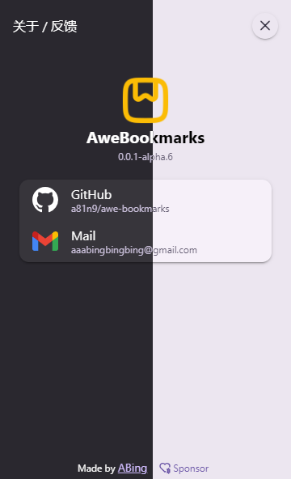

# AweBookmarks

   

重新定义书签管理

## 👋 介绍

> [!IMPORTANT]
> AweBookmarks 保证不会在任何情况下收集用户信息

> [!CAUTION]
> 如果您正在安装此扩展程序，您的浏览器可能会收到某些警告提示。
>
> 这是因为 AweBookmarks 使用了 [bookmarks 权限](https://developer.chrome.com/docs/extensions/reference/api/bookmarks)，该权限用于获取浏览器书签数据，从而通过此插件进行展示。
>
> **一些浏览器会提到最坏的情况和最高的风险，以确保您在安装后的安全。**

AweBookmarks 是一个用于书签管理的浏览器扩展，主要专注于 书签关联检索（分词模糊检索并以目录树展示），并且在渲染层进行了一些优化，基于虚拟树方案保证书签数据过大时依然丝滑流畅。

## ⬇️ 安装

> [!TIP]
> 此插件暂未在任何扩展商店发布，请自行安装
>
> 以下安装方式以 `Chrome 浏览器` 为例，其他浏览器安装方式基本上相同，若有差异请自行查阅。

1. 前往 [Releases](https://github.com/a81n9/awe-bookmarks/releases) 下载最新的 `crx` 文件
2. 在 `Chrome 浏览器` 中打开 `chrome://extensions` 并打开界面右上角 `开发者模式` 选项
3. 只需将下载的 `crx` 文件拖放到浏览器中即可完成安装

## 🛠️ 使用

- <svg xmlns="http://www.w3.org/2000/svg" width="1.5em" height="1.5em" viewBox="0 0 256 256"><path fill="currentColor" d="M144 16h-32a64.07 64.07 0 0 0-64 64v96a64.07 64.07 0 0 0 64 64h32a64.07 64.07 0 0 0 64-64V80a64.07 64.07 0 0 0-64-64m48 64v24h-64V32h16a48.05 48.05 0 0 1 48 48m-48 144h-32a48.05 48.05 0 0 1-48-48v-56h128v56a48.05 48.05 0 0 1-48 48" stroke-width="6.5" stroke="currentColor"/></svg> 左键单击对应书签可在活动标签页打开

  - 同时按下 <kbd>Ctrl</kbd> 或 <kbd>Cmd</kbd> 可在非活动标签页打开（用于同时打开多个书签）
  - 同时按下 <kbd>Shift</kbd> 可在新窗口中打开

- <svg xmlns="http://www.w3.org/2000/svg" width="1.5em" height="1.5em" viewBox="0 0 256 256"><path fill="currentColor" d="M144 16h-32a64.07 64.07 0 0 0-64 64v96a64.07 64.07 0 0 0 64 64h32a64.07 64.07 0 0 0 64-64V80a64.07 64.07 0 0 0-64-64m-32 16h16v72H64V80a48.05 48.05 0 0 1 48-48m32 192h-32a48.05 48.05 0 0 1-48-48v-56h128v56a48.05 48.05 0 0 1-48 48" stroke-width="6.5" stroke="currentColor"/></svg> 右键单击展示对应操作菜单

- 检索框失焦状态下按下 <kbd>Tab</kbd> 可快速聚焦
- <kbd>Esc</kbd> 可关闭任何弹出层，当没有弹出层时则关闭插件 `popup`

## 📷 预览

  
  

## ❤️ 赞助

  
  

