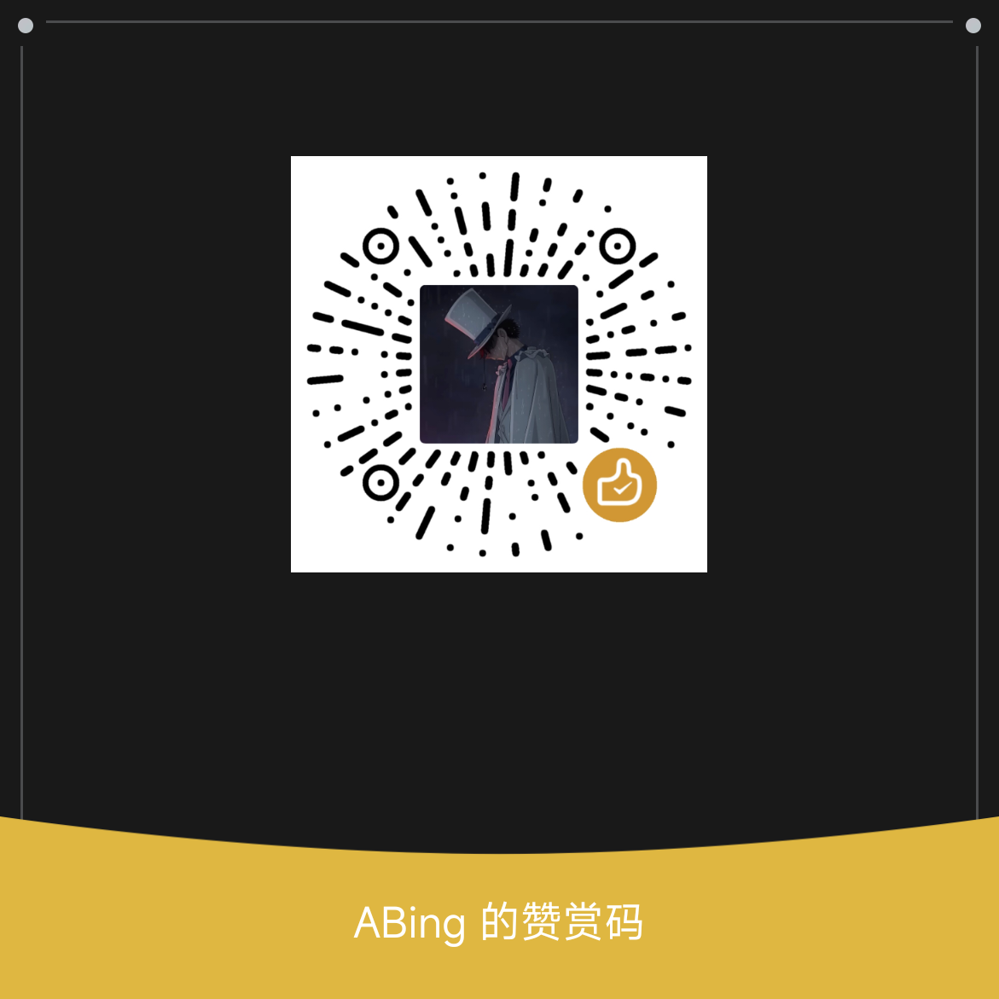

# AweBookmarks

   

重新定义书签管理

## 👋 介绍

> [!IMPORTANT]
> AweBookmarks 保证不会在任何情况下收集用户信息

> [!CAUTION]
> 如果您正在安装此扩展程序，您的浏览器可能会收到某些警告提示
>
> 这是因为 AweBookmarks 使用了 [bookmarks 权限](https://developer.chrome.com/docs/extensions/reference/api/bookmarks)，该权限用于获取浏览器书签数据，从而通过此插件进行展示
>
> **一些浏览器会提到最坏的情况和最高的风险，以确保您在安装后的安全**

AweBookmarks 是一个用于书签管理的浏览器扩展，主要专注于 书签关联检索（分词模糊检索并以目录树展示），并且在渲染层进行了一些优化，基于虚拟树方案保证书签数据过大时依旧丝滑流畅

## ⬇️ 安装

### 🌐 在线安装

- Edge: <https://microsoftedge.microsoft.com/addons/detail/pfjpmhmlddlkjndmlenppfcncjeaofel>
- CrxSoSo: <https://www.crxsoso.com/addon/detail/pfjpmhmlddlkjndmlenppfcncjeaofel>
- Chrome: _审核中..._

### ⚙️ 手动安装

> [!TIP]
> 请自行前往 [CrxSoSo](https://www.crxsoso.com/addon/detail/pfjpmhmlddlkjndmlenppfcncjeaofel) 安装
>
> 以下安装方式以 `Chrome 浏览器` 为例，其他浏览器安装方式基本上相同，若有差异请自行查阅

1. 前往 [CrxSoSo](https://www.crxsoso.com/addon/detail/pfjpmhmlddlkjndmlenppfcncjeaofel) 下载最新的 `crx` 文件
2. 在 `Chrome 浏览器` 中打开 `chrome://extensions` 并打开界面右上角 `开发者模式` 选项
3. 只需将下载的 `crx` 文件拖放到浏览器中即可完成安装
4. 若提示 `未知来源` 相关警告导致无法启用扩展，解决方案可参考 [Chrome / Edge 禁止其他来源 crx 安装的解决方案](https://zhuanlan.zhihu.com/p/1921953956927604422)

5. 若要设置插件快捷键，可在 `chrome://extensions/shortcuts` 中自行配置

## 🛠️ 使用

- <kbd>LeftClick</kbd> 单击对应书签可在活动标签页打开

  - 同时按下 <kbd>Ctrl</kbd> 或 <kbd>Cmd</kbd> 或 <kbd>MiddleClick</kbd> 点击可在非活动标签页打开（用于同时打开多个书签）
  - 同时按下 <kbd>Shift</kbd> 可在新窗口中打开

- <kbd>RightClick</kbd> 可展示对应操作菜单
- 检索框失焦状态下按下 <kbd>Tab</kbd> 可快速聚焦
- <kbd>Esc</kbd> 可关闭任何弹出层，当没有弹出层时则关闭插件 `popup`

### ⌨️ 键盘导航

- 使用 <kbd>ArrowDown</kbd> <kbd>ArrowUp</kbd> 选择对应节点
- <kbd>Enter</kbd> 可代替 <kbd>LeftClick</kbd> 功能

  - 同时按下 <kbd>Ctrl</kbd> 或 <kbd>Cmd</kbd> 或 <kbd>MiddleClick</kbd> 点击可在非活动标签页打开（用于同时打开多个书签）
  - 同时按下 <kbd>Shift</kbd> 可在新窗口中打开

## 📷 预览

  
  

## ❤️ 赞助

[PayPal](https://www.paypal.com/paypalme/aaabingbing)
|
[Buy Me a Coffee](https://buymeacoffee.com/aaabingbing)

  
  
  

